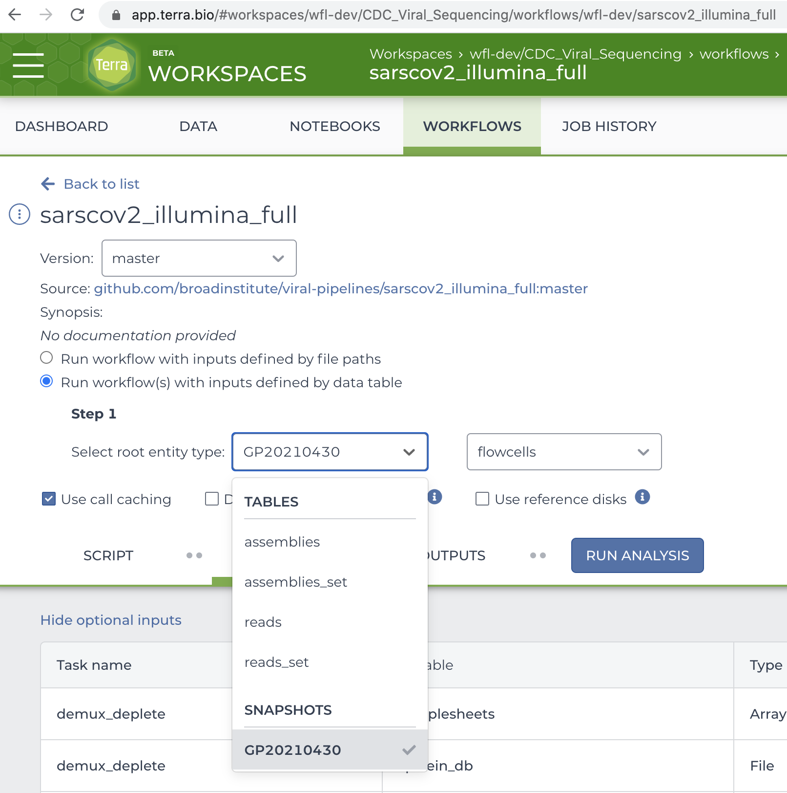

# Executor
The workload `Executor` models an intermediate stage of a processing pipeline.
In a typical workload configuration, an `Executor` uses a supported
service in the cloud to execute workflows.

## User Guide
You can configure the type of `Executor` used in your workload by changing the
`executor` attribute of your workload request.

### `Terra` Executor
You can execute workflows in a Terra workspace using the `Terra` executor.

The `Terra` executor will...

- Coerce available outputs from an upstream `Source` to a data type acceptable
  for submission creation
  (i.e. import a snapshot to the `executor` workspace as a reference)
- Update the method configuration with the coerced object as its root entity
  type
- Launch a submission
- Periodically update the statuses of eligible workflows to enable a
  downstream `Sink` to consume their outputs

A typical `Terra` executor configuration in the workload request looks like:
```json
{
  "name": "Terra",
  "workspace": "{workspace-namespace}/{workspace-name}",
  "methodConfiguration": "{method-configuration-namespace}/{method-configuration-name}",
  "methodConfigurationVersion": 1,
  "fromSource": "importSnapshot"
}
```

And a real-life example for a known method configuration:
```json
{
  "name": "Terra",
  "workspace": "wfl-dev/CDC_Viral_Sequencing",
  "methodConfiguration": "wfl-dev/sarscov2_illumina_full",
  "methodConfigurationVersion": 1,
  "fromSource": "importSnapshot"
}
```



The table below summarises the purpose of each attribute in the above request.

| Attribute                    | Description                                                                                       |
|------------------------------|---------------------------------------------------------------------------------------------------|
| `name`                       | Selects the `Terra` executor implementation.                                                      |
| `workspace`                  | Terra Workspace in which to execute workflows.                                                    |
| `methodConfiguration`        | Method configuration from which to generate submissions.                                          |
| `methodConfigurationVersion` | Expected version of the method configuration.                                                     |
| `fromSource`                 | Instruction to coerce an output from an upstream `Source` to a type understood by this `executor`.|

#### `workspace`
A `{workspace-namespace}/{workspace-name}` string as it appears in the URL path
in the Terra UI.

Prerequisites:

- The workspace must exist prior to workload creation.
- `workflow-launcher@firecloud.org` must be a workspace "Owner" in order to
  import snapshots to the workspace.
- The workspace must be compatible with any downstream processing stage that
  consumes its workflows.

#### `methodConfiguration`
A `{method-configuration-namespace}/{method-configuration-name}` string as it
appears in the URL path in the Terra UI.

Prerequisites:

- The method configuration must exist within `workspace` prior to
  workload creation.

#### `methodConfigurationVersion`
The expected version of `methodConfiguration`, stored as an integer
in Firecloud.

Prerequisites:

- The `methodConfiguration` version when fetched from Firecloud should match
  `methodConfigurationVersion`.

!!! warning "Implications of Version Mismatch"
    A version mismatch may indicate a possible concurrent modification of the
    method configuration used for launching submissions.  Modification is possible
    programmatically or via the Terra UI.  An unexpected modification may cause
    submission and/or workflow creation to fail.

#### `fromSource`
This attribute tells workflow-launcher how to coerce an output
from an upstream `Source` into a data type understood by the executor.

Prerequisites:

- Must be one of the following supported coercion instructions.

###### `importSnapshot`
Workflow-launcher should import Terra Data Repository (TDR) snapshots
into `workspace` as snapshot references,
updating `methodConfiguration` with the reference as its root entity type.

## Developer Guide
An executor is a `Queue` that satisfies the `Executor` protocol below:
```clojure
(defprotocol Executor
  (update-executor!
    ^Executor
    [^Queue    upstream  ;; The queue from which to pull items to execute
     ^Executor executor  ;; This executor instance
    ]
    "Consume items from the `upstream` queue and enqueue
     to the `executor` queue for consumption by a later processing stage,
     performing any external effects as necessary.
     Implementations should avoid maintaining in-memory state and making long-
     running external calls, favouring internal queues to manage such tasks
     asynchronously between invocations.  Note that the `Executor` and `Queue`
     are parameterised types and the `Queue`'s parameterisation must be
     convertible to the `Executor`s.")
  (executor-workflows
    ^IPersistentVector
    [^Connection transaction  ;; JDBC Connection
     ^Executor   executor     ;; This executor instance
     ]
    "Use database `transaction` to return workflows created by the `executor`.")
  (executor-workflows-by-status
    ^IPersistentVector
    [^Connection transaction  ;; JDBC Connection
     ^Executor   executor     ;; This executor instance
     ^String     status       ;; workflow status to match
    ]
    "Use database `transaction` to return workflows created by the `executor`
     matching the workflow `status`.")
  (executor-retry-workflows!
    ;; Executed for side effects
    [^Executor          executor   ;; This executor instance
     ^IPersistentVector workflows  ;; Workflows to retry
    ]
    "Retry/resubmit the `workflows` managed by the `executor`."))
```

!!! note
    The `Executor` protocol is implemented by a set of multimethods of the same
    name. The use of a protocol is to illustrate the difference between the
    in-memory data model of a `Executor` and the metadata seen by a user.

To be used in a workload,
an `Executor` implementation
should satisfy the processing `Stage` protocol
and the `to-edn` multimethod
in addition to the following multimethods
specific to executors:

```clojure
(defmulti create-executor
  "Create an `Executor` instance using the database `transaction` and
   configuration in the executor `request` and return a
   `[type items]` pair to be written to a workload record as
   `executor_type` and `executor_items`.
   Notes:
   - This is a factory method registered for workload creation.
   - The `Executor` type string must match a value of the `executor` enum
     in the database schema.
   - This multimethod is type-dispatched on the `:name` association in the
     `request`."
  (fn ^[^String ^String]
      [^Connection         transaction  ;; JDBC Connection
       ^long               workload-id  ;; ID of the workload being created
       ^IPersistentHashMap request      ;; Data forwarded to the handler
      ]
      (:name request)))

(defmulti load-executor!
  "Return the `Executor` implementation associated with the `executor_type` and
   `executor_items` fields of the `workload` row in the database.
   Note that this multimethod is type-dispatched on the `:executor_type`
   association in the `workload`."
  (fn ^Executor
      [^Connection         transaction  ;; JDBC Connection
       ^IPersistentHashMap workload     ;; Row from workload table
      ]
      (:executor_type workload)))
```
