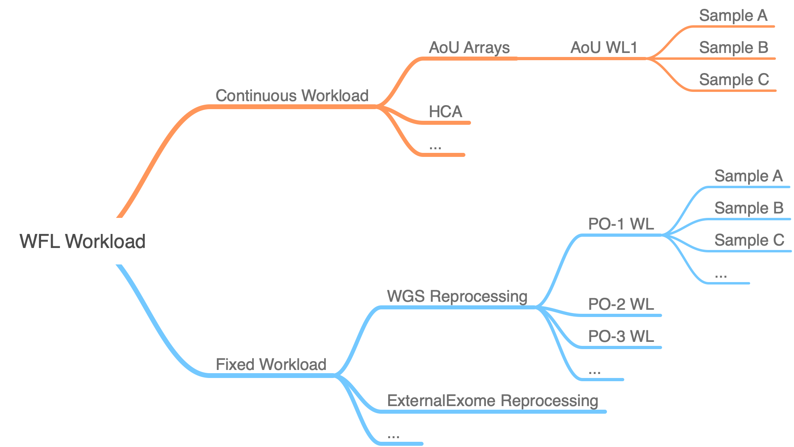

# Modules Design Principles and Assumptions

WorkFlow Launcher is responsible for preparing the required
workflow WDLs, inputs and options for Cromwell in a large scale.
This work involves in inputs validation, pipeline WDL orchestration
and Cromwell workflow management. Similar to other WFL modules, the
`aou-arrays` module takes advantage of the `workload` concept in order
to manage workflows efficiently.

In general, WFL classify all workloads into 2 categories: continuous and fixed.
For instance, `aou-arrays` module implements arrays workload as a continuous
workload, which means all samples are coming in like a continuous stream,
and WFL does not make any assumption of how many samples will be in the workload
or how to group the samples together: it hands off the workload creation and
starting process to its caller. `wgs` module implements External Whole Genome
workloads as a discrete workload that WFL has full knowledge about the number
and properties of the samples it's going to process, and the samples can be grouped
into batches (workloads) by a set of properties.

To learn more about the details of each module, please check their own sections in
this documentation.

## Create a workload

Defining a workload type usually requires these top-level parameters.

| Parameter | Type       |              Required              |
|-----------|------------|:----------------------------------:|
| executor  | URL        | :fontawesome-regular-check-square: |
| output    | URL prefix  | :fontawesome-regular-check-square: |
| pipeline  | pipeline   | :fontawesome-regular-check-square: |
| project   | text       | :fontawesome-regular-check-square: |
| common    | object     |                                    |
| input     | URL prefix  |                                    |
| items     | object     |                                    |

The parameters are used this way.

- The `executor` URL specifies the Cromwell instance or 
other execution engine to service the _workload_.
- The `output` URL prefix specifies the path you'd like WFL
to dump the results to. It usually is a _gs_ bucket.
- The `pipeline` enumeration implicitly identifies a data
schema for the inputs to and outputs from the workload.
You can think of it as the _kind_ of workflow
specified for the workload.
People sometimes refer to this as _the tag_
in that it is a well-known name
for a Cromwell pipeline defined in WDL.
You might also think of `pipeline`
as the external or official name
of a WFL processing module.
- The `project` is just some text
to identify a researcher,
billing entity,
or cost object
responsible for the workload.
- The `common` is something common for all of the samples, such as the workflow options. For more details, check the docs for the specific type of workload you are trying to submit.
- The `input` URL prefix specifies the path you'd like WFL
to read (a batch of) sample(s) from. It usually is a _gs_ bucket.
- The `items` is used to configure individual units of a workload. You can use it to tell WFL to treat arbitrary parts of the workload sepcially. For more details, check the docs for the specific type of workload you are trying to submit.
