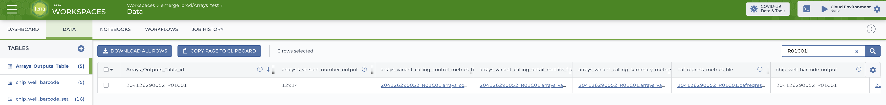

# Sink

The workload `Sink` models the terminal stage
of a processing pipeline.
In a typical workload configuration,
a `Sink` can be used to write workflow outputs
to a desired location in the cloud.

## User Guide
You can configure the type of `Sink` used in your workload by changing the
`sink` attribute of your workload request.

### Terra Workspace Sink
You can write workflow outputs to a Terra Workspace using the `Terra Workspace`
sink. A typical `Terra Workspace` sink configuration in the workload request
looks like:
```json
{
  "name": "Terra Workspace",
  "workspace": "{workspace-namespace}/{workspace-name}",
  "entityType": "{entity-type-name}",
  "identifier": "{workflow-identifier}",
  "fromOutputs": {
    "attribute0": "output0",
    "attribute1": ["output1", "output2"],
    "attribute3": "$literal",
    ...
  }
}
```
The table below summarises the purpose of each attribute in the above request.

| Attribute     | Description                                                                 |
|---------------|-----------------------------------------------------------------------------|
| `name`        | Selects the `Terra Workspace` sink implementation.                          |
| `workspace`   | The Terra Workspace to write pipeline outputs to.                           |
| `entityType`  | The entity type in the `workspace` to write outputs to.                     |
| `identifier`  | Selects the workflow attribute (output or input) to use as the entity name. |
| `fromOutputs` | Mapping from outputs to attribute names in the `entityType`.                |

#### `workspace`
The workspace is a `"{workspace-namespace}/{workspace-name}"` string as it
appears in the URL path in the Terra UI. The workspace must exist prior to
workload creation. You must ensure that `workflow-launcher@firecloud.org` is
a workspace "Writer" in order to write entities to the workspace.

#### `entityType`
The `entityType` is the name of the entity type in the workspace that entities
will be created as. The entity type must exist prior to workload creation and
must be a table in the workspace.

#### `identifier`

WFL tries to find a workflow output whose name matches `identifier`,
checking workflow input names as a fallback.
The matching value will be the name of the newly created entity.

Both workflow outputs and inputs are checked for matches since
depending on use case, the logical unique identifier may be either.

!!! warnings
    - If an `identifier` has no matching workflow output or input,
    WFL will not be able to resolve a workflow to an entity name
    and will fail to write its outputs to the workspace data table.
    - When two workflows share the same `identifier` value,
    the first set of outputs will be overwritten by the second in the workspace.

**Example:**

An eMerge Arrays workflow has an output called "chip_well_barcode_output"
that uniquely identifies its inputs and outputs.

By setting `"identifier": "chip_well_barcode_output"`
in the sink configuration, entities will be created
using the "chip_well_barcode_output" as the entity name.

Below, the outputs for a successful workflow with a "chip_well_barcode_output"
of "204126290052_R01C01" have been written to the destination data table.



#### `fromOutputs`

`fromOutputs` configures how to create new entities from pipeline outputs
by mapping the output names to attributes in the `entityType`.
Note that all attribute names must exist
in the entityType before the workload  creation.

`fromOutputs` allows a small amount of flexibility in how to construct an entity
and supports the following relations:

- `"attribute": "output"`
  Direct mapping from an output to an attribute

- `"attribute": ["output0", "output2"]`
  Make an attribute from a list of pipeline outputs.

- `"attribute": "$value"`
  Use the literal "value" for an attribute.

### Terra Data Repository Sink
You can write workflow outputs to a Terra Data Repository dataset using the
`Terra DataRepo` sink. A typical `Terra DataRepo` sink configuration in the
workload request looks like:
```json
{
  "name": "Terra DataRepo",
  "dataset": "{dataset-id}",
  "table": "{table-name}",
  "fromOutputs": {
    "column0": "output0",
    "column1": ["output1", "output2"],
    "column3": "$literal",
    ...
  }
}
```
The table below summarises the purpose of each attribute in the above request.

| Attribute     | Description                                                  |
|---------------|--------------------------------------------------------------|
| `name`        | Selects the `Terra Workspace` sink implementation.           |
| `dataset`     | The `UUID` of dataset to monitor and read from.              |
| `table`       | The name of the `dataset` table to monitor and read from.    |
| `fromOutputs` | Mapping from outputs to columns in the `table`.              |

#### `dataset`
The dataset attribute is the `UUID` that uniquely identifies the TDR dataset you
want workflow-launcher to write workflow outputs to.

#### `table`

The `table` is the name of the table in the dataset
that you want workflow-launcher
to write workflow outputs to.
Once a workflow succeeds,
its outputs will be ingested
as new rows in that table (see note).
You cannot write to more than one table per `Terra DataRepo` sink.

!!! note
    workflow-launcher transforms outputs into a form conformant with the table
    in the dataset using the transformation described by `fromOutputs`. The
    columns in your table don't have to be an exact match for the output names.
    See below for more details.

#### `fromOutputs`
`fromOutputs` configures how to create new rows in the `table` from pipeline
outputs by mapping the output names to columns in the `table`.

`fromOutputs` allows a small amount of flexibility in how to construct an entity
and supports the following relations:

- `"column": "output"`
  Direct mapping from an output to a column

- `"column": ["output0", "output2"]`
  Make a column from an array of pipeline outputs.

- `"column": "$value"`
  Use the literal "value" for a column.

!!! note
    Any output not included in `fromOutputs` will not be ingested into the
    dataset

!!! note
    Any column not included in `fromOuputs` will not have a value in the newly
    added row.

## Developer Guide
A sink is one satisfying the `Sink` protocol as below:
```clojure
(defprotocol Sink
  (update-sink!
    ^Sink
    [^Queue upstream ;; The queue to sink outputs from
     ^Sink  sink     ;; This sink instance
    ]
    "Update the internal state of the `sink`, consuming objects from the
     Queue `upstream`, performing any external effects as required.
     Implementations should avoid maintaining in-memory state and making long-
     running external calls, favouring internal queues to manage such tasks
     asynchronously between invocations. Note that The `Sink` and `Queue` are
     parameterised types and the `Queue`'s parameterisation must be convertible
     to the `Sink`s."))
```

!!! note
    The `Sink` protocol is implemented by the `update-sink!` multimethod.
    It's documented thus as a means of differentiating the in-memory data model
    from the metadata a user sees.

To be used in a workload,
a `Sink` implementation should satisfy `Stage`,
the `to-edn` multimethod
and the following multimethods specific to `Sink`s:

```clojure
(defmulti create-sink
  "Create a `Sink` instance using the database `transaction` and configuration
   in the sink `request` and return a `[type items]` pair to be written to a
   workload record as `sink_type` and `sink_items`.
   Notes:
   - This is a factory method registered for workload creation.
   - The `Sink` type string must match a value of the `sink` enum in the
     database schema.
   - This multimethod is type-dispatched on the `:name` association in the
     `request`."
  (fn ^[^String ^String]
      [^Connection         transaction  ;; JDBC Connection
       ^long               workload-id  ;; ID of the workload being created
       ^IPersistentHashMap request      ;; Data forwarded to the handler
      ]
      (:name request)))

(defmulti load-sink!
  "Return the `Sink` implementation associated with the `sink_type` and
   `sink_items` fields of the `workload` row in the database. Note that this
   multimethod is type-dispatched on the `:sink_type` association in the
   `workload`."
  (fn ^Sink
      [^Connection         transaction  ;; JDBC Connection
       ^IPersistentHashMap workload     ;; Row from workload table
      ]
      (:sink_type workload)))
```
