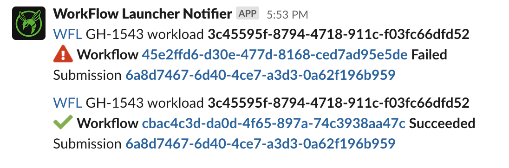

# Staged Workloads

A staged workload takes data from a source,
pushes it into a workflow executor for analysis,
and then delivers the results of the analysis
to an output location (also known as a sink).

Depending on the workload's source, processing may be
continuous -- inputs streaming in until stopped --
or discrete -- all inputs known at workload creation.

## Staged Workload Components
### Source
The workload [Source](./staged-source.md) models the first stage of a processing pipeline.
A `Source` reads workflow inputs from a specified location
or service in the cloud.

### Executor
The workload [Executor](./staged-executor.md) models an intermediate stage of a processing pipeline.
An `Executor` uses a supported service in the cloud to execute workflows.

### Sink
The workload [Sink](./staged-sink.md) models the terminal stage of a processing pipeline.
A `Sink` writes workflow outputs to a desired location in the cloud.

## Example Staged Workload
The specific values below are derived from the
"COVID-19 Surveillance in Terra" project.

Workloads for other projects may leverage different implementations
for source, executor or sink.

For guidance on how to interact with staged workloads
via WFL API, see [API Usage](./staged-api-usage.md).

```
{
    "watchers": [
        ["slack", "C000XXX0XXX"],
        ["slack", "C000YYY0YYY", "#optional-channel-name-for-context"]
    ],
    "labels": [
        "hornet:test"
    ],
    "project": "wfl-dev/CDC_Viral_Sequencing",
    "source": {
        "name": "Terra DataRepo",
        "dataset": "4bb51d98-b4aa-4c72-b76a-1a96a2ee3057",
        "table": "flowcells",
        "snapshotReaders": [
            "workflow-launcher-dev@firecloud.org"
        ]
    },
    "executor": {
        "name": "Terra",
        "workspace": "wfl-dev/CDC_Viral_Sequencing",
        "methodConfiguration": "wfl-dev/sarscov2_illumina_full",
        "methodConfigurationVersion": 1,
        "fromSource": "importSnapshot"
    },
    "sink": {
        "name": "Terra Workspace",
        "workspace": "wfl-dev/CDC_Viral_Sequencing",
        "entityType": "flowcell",
        "identifier": "run_id",
        "fromOutputs": {
            "submission_xml" : "submission_xml",
            "assembled_ids" : "assembled_ids",
            "num_failed_assembly" : "num_failed_assembly",
            ...
        }
    }
}
```

## Staged Workload Anatomy (High Level)

| Field    | Type   | Description                                                                                                                                                                                                                                 |
|----------|--------|----------------------------------------------------------------------------------------------------------------------------------------------------------------------------------------------------------------------------------------------|
| watchers | List   | An optional list of Slack channels to notify                                                                                                                                                                                                 |
| labels   | List   | A list of user-defined labels. They must be a string of the form `"name":"value”`, where `name` must start with a letter followed by any combination of digits, letters, spaces, underscores and hyphens and `value` is any non-blank string |
| project  | String | A non-null string to allow querying workloads by project                                                                                                                                                                                     |
| source   | Object | The source of new workflow inputs                                                                                                                                                                                                            |
| executor | Object | The mechanism executing the analysis                                                                                                                                                                                                         |
| sink     | Object | The destination for workflow outputs                                                                                                                                                                                                         |


## Slack Notifications for Watchers

!!! warning
    Slack notifications are temporarily disabled:
    see [GH-1604](https://broadinstitute.atlassian.net/browse/GH-1604).

The optional `watchers` field in a workload request
registers Slack channels as watchers of the workload.

```
"watchers": [
        ["slack", "C000XXX0XXX"],
        ["slack", "C000YYY0YYY", "#optional-channel-name-for-context"]
    ]
```

When specified, WFL expects a list of **Slack channel IDs**.
You can also add the channel name as the watcher's third element,
but because channel names can change this is for decoration
and debugging assistance only and not accessed programmatically.

Slack channel IDs start with a `C` and can be found at the bottom
of your channel's "Get channel details" dropdown:


### What notifications are emitted?

**User-facing exceptions**
- Ex. Issues accessing TDR dataset, snapshot, etc.

**Notable state changes**
- Ex. Workflow has completed



In the future, WFL may allow for these two notification streams
to be configured separately.
High-volume use cases (ex. 100s of workflows/day) may find
state change notifications too noisy.

### Prerequisites

- Channel must live in the `broadinstitute.slack.com`
  Slack organization

- The WFL notifier Slack App has been added to your channel --
  `/invite @WorkFlow Launcher Notifier`

### Stopping Notifications

If notifications are too noisy, you can `/remove @WorkFlow Launcher Notifier`
from your channel as a quick fix.

At this time, there isn't a way to update the `watchers` list
for an existing workload.

The long-term approach is to stop your workload,
recreate it with an updated `watchers` list,
and start the new workload.
