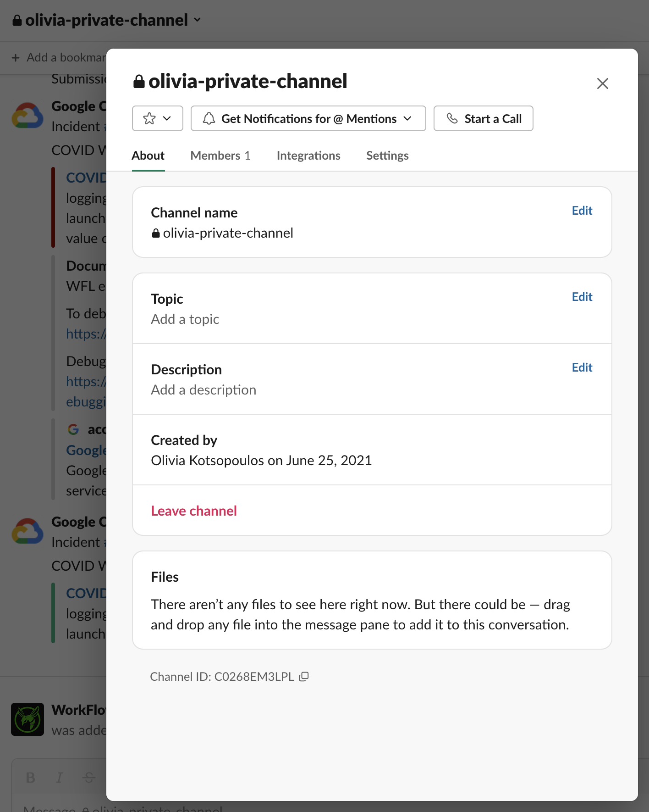

# Staged Workloads

A staged workload is a discrete body of work, which takes data from a source,
pushes it into a workflow executor for analysis,
and then delivers the results of the analysis to an output location (also known as a sink).

## Staged Workload Components
### Source
The workload [Source](./source.md) models the first stage of a processing pipeline.
In a typical workload configuration, a `Source` can be used to read workflow inputs
from a specified location or service in the cloud.

### Executor
The workload [Executor](./executor.md) models an intermediate stage of a processing pipeline.
In a typical workload configuration, an `Executor` uses a supported
service in the cloud to execute workflows.

### Sink
The workload [Sink](./sink.md) models the terminal stage of a processing pipeline.
In a typical workload configuration, a `Sink` can be used to write workflow outputs
to a desired location in the cloud.

## Example Staged Workload
The specific values below are from the
[COVID-19 Surveillance in Terra](./modules-covid.md) project.
Workloads for other projects may leverage different implementations for source, executor or sink.

```
{
    "watchers": [
        ["slack", "C000XXX0XXX"],
        ["slack", "C000YYY0YYY", "#optional-channel-name-for-context"]
    ],
    "labels": [
        "hornet:test"
    ],
    "project": "wfl-dev/CDC_Viral_Sequencing",
    "source": {
        "name": "Terra DataRepo",
        "dataset": "4bb51d98-b4aa-4c72-b76a-1a96a2ee3057",
        "table": "flowcells",
        "snapshotReaders": [
            "workflow-launcher-dev@firecloud.org"
        ]
    },
    "executor": {
        "name": "Terra",
        "workspace": "wfl-dev/CDC_Viral_Sequencing",
        "methodConfiguration": "wfl-dev/sarscov2_illumina_full",
        "methodConfigurationVersion": 1,
        "fromSource": "importSnapshot"
    },
    "sink": {
        "name": "Terra Workspace",
        "workspace": "wfl-dev/CDC_Viral_Sequencing",
        "entityType": "flowcell",
        "identifier": "run_id",
        "fromOutputs": {
            "submission_xml" : "submission_xml",
            "assembled_ids" : "assembled_ids",
            "num_failed_assembly" : "num_failed_assembly",
            ...
        }
    }
}
```

## Staged Workload Anatomy (High Level)

| Field    | Type   | Description                                                                                                                                                                                                                                 |
|----------|--------|---------------------------------------------------------------------------------------------------------------------------------------------------------------------------------------------------------------------------------------------|
| watchers | List   | An optional list of Slack channels to notify                                                                                                                                                                                                |
| labels   | List   | A list of user-defined labels.They must be a string of the form `"name":"value”`, where `name` must start with a letter followed by any combination of digits, letters, spaces, underscores and hyphens and `value` is any non-blank string |
| project  | String | The project is a non-null string required in the workload table. It's needed to support querying workloads by project                                                                                                                       |
| source   | Object | The data source                                                                                                                                                                                                                             |
| executor | Object | The mechanism executing the analysis. (Most often this is Terra)                                                                                                                                                                            |
| sink     | Object | The location where data will be placed after analysis is complete                                                                                                                                                                           |


## Slack Notifications for Watchers

The optional `watchers` field in a workload request
registers Slack channels as watchers of the workload.

```
"watchers": [
        ["slack", "C000XXX0XXX"],
        ["slack", "C000YYY0YYY", "#optional-channel-name-for-context"]
    ]
```

When specified, WFL expects a list of **Slack channel IDs**.
You can also add the channel name as the watcher's third element,
but because channel names can change this is for decoration
and debugging assistance only and not accessed programmatically.

Slack channel IDs start with a `C` and can be found at the bottom
of your channel's "Get channel details" dropdown:



### What notifications are emitted?

**User-facing exceptions**
- Ex. Issues accessing TDR dataset, snapshot, etc.

**Notable state changes**
- Ex. Workflow has completed


In the future, WFL may allow for these two notification streams
to be configured separately.
High-volume use cases (ex. 100s of workflows/day) may find
state change notifications too noisy.

### Prerequisites

- Channel must live in the `broadinstitute.slack.com`
  Slack organization

- The WFL notifier Slack App has been added to your channel --
  `/invite @WorkFlow Launcher Notifier`

### Stopping Notifications

If notifications are too noisy, you can `/remove @WorkFlow Launcher Notifier`
from your channel as a quick fix.

At this time, there isn't a way to update the `watchers` list
for an existing workload.

The long-term approach is to stop your workload,
recreate it with an updated `watchers` list,
and start the new workload.
