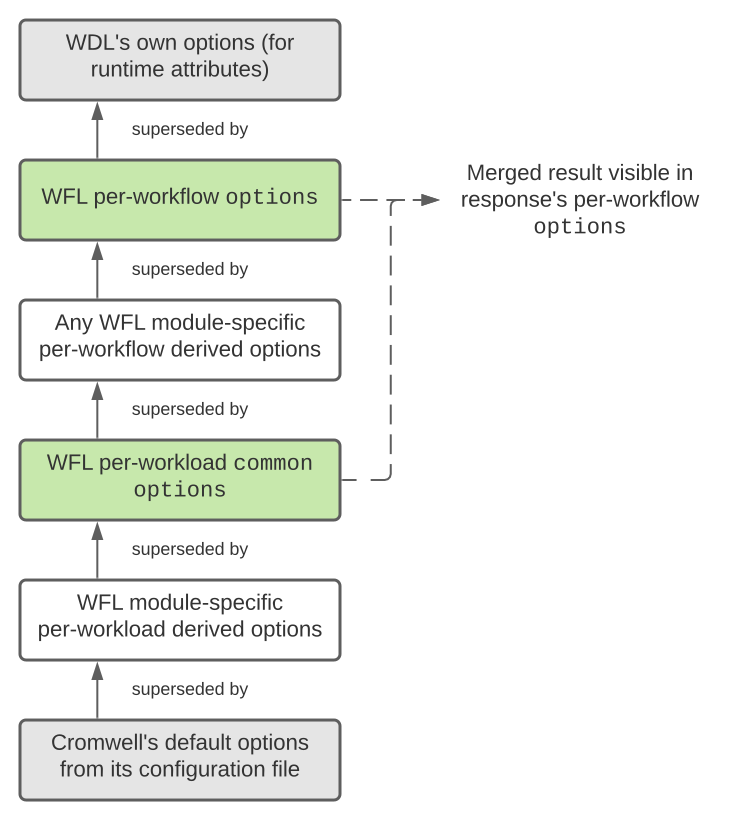

# Customizing Workflow Options

???+ tip
    This page covers customizing workflow _options_, which are different from the
    _inputs_ passed to the WDL. Workflow options are interpreted directly by Cromwell,
    though WDLs can customize them too. For more information see
    [Cromwell's documentation](https://cromwell.readthedocs.io/en/stable/wf_options/Overview/).

    Another important piece of context for this page is the difference between a workflow
    that actually gets run on Cromwell versus a workload (a WFL-managed set of individual
    workflows).


## Usage

!!! info "Summary"
    - Workflow options are an arbitrary JSON object stored in a key of `options`
    - Can be provided either per-workflow or for an entire workload (or both)
    - Optional when you make requests but will always be included in WFL's responses

Suppose the following valid workload request that you might `POST` to `/create` or `/exec`:

```json
{
  "cromwell": "https://cromwell-gotc-auth.gotc-dev.broadinstitute.org",
  "input": "gs://broad-gotc-dev-wfl-ptc-test-inputs/single_sample/plumbing/truth",
  "output": "gs://broad-gotc-dev-wfl-ptc-test-outputs/wgs-test-output/",
  "pipeline": "ExternalWholeGenomeReprocessing",
  "project": "PO-1234",
  "items": [
    {
      "inputs": {
        "input_cram": "develop/20k/NA12878_PLUMBING.cram",
        "sample_name": "TestSample1234"
      }
    },
    {
      "inputs": {
        "input_cram": "develop/20k/NA12878_PLUMBING.cram",
        "sample_name": "TestSample5678"
      }
    }
  ]
}
```

You may optionally add arbitrary JSON objects as `options` either for individual
workflows, for the entire workload, or both:

```json
{
  "cromwell": "https://cromwell-gotc-auth.gotc-dev.broadinstitute.org",
  "input": "gs://broad-gotc-dev-wfl-ptc-test-inputs/single_sample/plumbing/truth",
  "output": "gs://broad-gotc-dev-wfl-ptc-test-outputs/wgs-test-output/",
  "pipeline": "ExternalWholeGenomeReprocessing",
  "project": "PO-1234",
  "common": {
    "options": {
        "global_option": "something for all of the samples",
        "overwritten_option": "overwrite me for sample 5678"
    }
  },
  "items": [
    {
      "inputs": {
        "input_cram": "develop/20k/NA12878_PLUMBING.cram",
        "sample_name": "TestSample1234"
      },
      "options": {
        "my_option": "something for sample 1234"
      }
    },
    {
      "inputs": {
        "input_cram": "develop/20k/NA12878_PLUMBING.cram",
        "sample_name": "TestSample5678"
      },
      "options": {
        "my_option": "something different for sample 5678",
        "another_option": {"foo": "bar"},
        "overwritten_option": "use this value instead"
      }
    }
  ]
}
```

???+ info
    This behavior isn't supported for All-of-Us-related processing.

To recap, in the above example the following workflow options will be set:

- "my_option" will have different strings for the different samples
- "another_option" will be an object just set for the latter sample
- "global_option" will be the same string for all samples
- "overwritten_option" is different for the latter sample

In other words, WFL will recursively merge the options objects together to
resolve the options for individual workflows. You can see this in WFL's
response, which includes all workflow options calculated for each workflow:

???+ info
    Some fields omitted for brevity

```json
{
  "pipeline": "ExternalWholeGenomeReprocessing",
  "created": "2020-10-05T15:50:01Z",
  "workflows": [
    {
      "inputs": {
        "input_cram": "develop/20k/NA12878_PLUMBING.cram",
        "sample_name": "TestSample1234"
      },
      "options": {
        "my_option": "something for sample 1234",
        "global_option": "something for all of the samples",
        "overwritten_option": "overwrite me for sample 5678"
      }
    },
    {
      "inputs": {
        "input_cram": "develop/20k/NA12878_PLUMBING.cram",
        "sample_name": "TestSample5678"
      },
      "options": {
        "my_option": "something different for sample 5678",
        "another_option": {"foo": "bar"},
        "global_option": "something for all of the samples",
        "overwritten_option": "use this value instead"
      }
    }
  ]
}
```

One note is that WFL already has some default values it passes for
workflow options and you'll see those defaults when you look at the
returned options for a given workflow.
See below for more information.

## Behavior

The diagram below lists the different sources of options for a particular
workflow. Precedence is from the bottom up, so "higher" sources override
lower ones.



The green "sources" are where you may optionally provide configuration
via `options`, the white "sources" are where WFL may create and
supply options by default, and the gray "sources" are outside of WFL's
visibility but can still affect the result.

WFL supplies its own derived options usually on a per-module basis,
meaning different pipelines that make use of different modules may
have different options they derive and supply by default.

Individual module documentation can help provide more info, as will
simply looking at WFL's response from the `/create` or `/exec` endpoints,
which includes those defaults.
